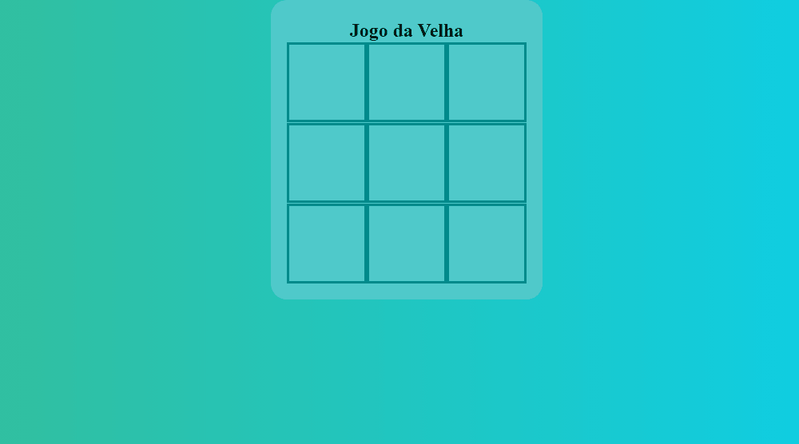

# *Jogo da Velha*
 *Jogo do galo ou três linhas é um jogo de passatempo popular.*

***
Bem vindo!   Click para Jogar
<a href="https://erikafrochati.github.io/Jogo-da-Velha/Jogo/index.html" target="_blank" rel="noopener noreferrer">Jogo criado com HTML, CSS e JavaScript</a>

 

****
## Agradecimentos :clap:

* Primeiramente a Deus.
* Se você achar que esse projeto agregou algo para você, por favor deixe uma estrela.
* Meus sinceros agradecimentos a todos que visitam o projeto e deixa uma estrela como reconhecimento.
* Que desafio foi montar esse jogo, 1 dia de trabalho, mas deu certo.
